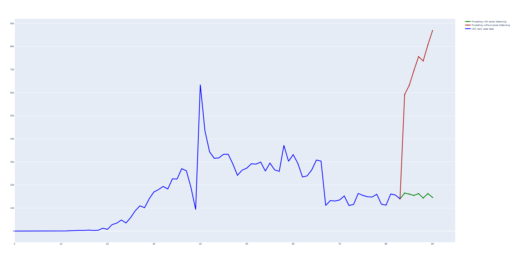

# Covid_Forecast
Looks at a local .txt file with data pulled from <a href="https://www.cdc.gov/coronavirus/2019-ncov/cases-updates/cases-in-us.html">CDC's daily cases for US</a> and forecasts a week in advance. Looks into new daily cases based on staying in quarantine vs non-quarantine and prints graph to browser. 

## Possible additions
* Data
    * pull data directly from CDC's site instead of storeing locally.
* Regression
    * Look into a logistical regression formula instead of linear.